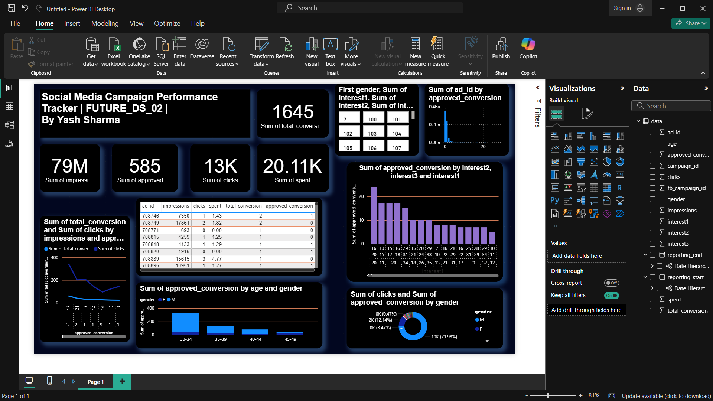

# FUTURE_DS_02_Dashboard
**Social Media Campaign Performance Tracker in Power BI**  
*Future Interns – Data Science & Analytics Internship (Task 2)*

---

##  Project Overview
This project is part of my **Future Interns Data Science & Analytics Internship (Task 2)**.  
The goal was to design a **Social Media Campaign Performance Tracker** in Power BI that gives insights into impressions, clicks, conversions, spending, and campaign effectiveness.

The dashboard highlights **key performance indicators (KPIs)** and provides a breakdown by gender, age, interests, and ad ID.  
I used a **professional modern theme** with consistent colors and intuitive layouts to ensure data storytelling is clear and impactful.

---

##  Dataset
The dataset provided by **Future Interns** contains:
- Ad & campaign IDs
- Impressions, clicks, spending
- Approved conversions
- Gender & age group
- Multiple interest categories

 **Download Dataset:** [Click Here](data.csv)

---

##  Key Features
- **KPI Cards:** Total Impressions, Approved Conversions, Clicks, Total Spend
- **Demographic Analysis:** Gender & Age-wise performance
- **Interest Analysis:** Approved conversions by interest category
- **Performance Trends:** Over time metrics for clicks and conversions
- **Ad-Level Insights:** Top-performing ads based on conversions
- **Modern UI:** Dark background with smooth alignment and visual consistency

---

##  Tools Used
- **Power BI**
- **Google Looker Studio**
- **Excel / Google Sheets**
- **Canva** *(for design elements)*

---

##  Dashboard Preview

---

##  Learnings & Takeaways
Through this task, I improved my skills in:
- Marketing analytics & campaign optimization
- Designing dashboards for storytelling & decision-making
- Advanced use of filters, slicers, and custom visuals in Power BI
- Structuring insights for both quick KPIs and deep-dive analysis

This project reinforced the importance of **clear data visualization** for marketing performance tracking.

---

##  Author
**Yash Sharma**  
🔗 [LinkedIn](https://www.linkedin.com/in/yash-sharma-8a04b82b8)  
🔗 [GitHub](https://github.com/hsaysh)  

---
 *If you found this project interesting, don't forget to star this repo!*

